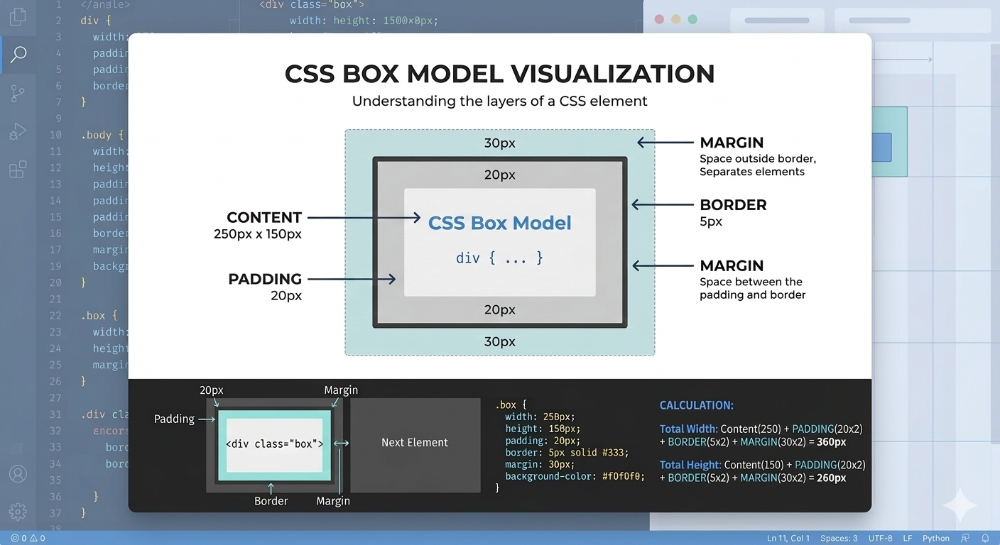

# Day 10 — CSS Box Model

Today, you will learn about the **CSS Box Model**, which is fundamental for **layout and spacing in webpages**.  
We will also explore **borders, shadows, outlines**, and **layout control properties**.

---

# 1. Box Model Concept

Every HTML element is a **rectangular box** consisting of:

1. **Content** – text, images, or other elements  
2. **Padding** – space between content and border  
3. **Border** – wraps the padding and content  
4. **Margin** – space between the element and other elements

### Diagram





---

# 2. Content

The **actual content** of the box, like text or image.

### Example

```css id="content_example"
div {
  width: 200px;
  height: 100px;
  background-color: lightblue;
}
````

---

# 3. Padding

Space **inside the box**, between content and border.

### Example

```css id="padding_example"
div {
  padding: 20px; /* 20px on all sides */
  background-color: lightblue;
}
```

* Can specify individually: `padding-top`, `padding-right`, `padding-bottom`, `padding-left`

---

# 4. Border

Wraps content + padding.

## 4.1 Border Styles

* `solid`, `dashed`, `dotted`, `double`, `groove`, `ridge`, `none`

### Example

```css id="border_styles"
div {
  border: 2px solid black;
}
```

## 4.2 Border Radius

Rounds the corners of the box.

### Example

```css id="border_radius"
div {
  border: 2px solid black;
  border-radius: 10px;
}
```

* `border-radius: 50%` → makes a circle (if width = height)

---

# 5. Margin

Space **outside the border**. Separates elements.

### Example

```css id="margin_example"
div {
  margin: 20px; /* 20px on all sides */
}
```

* Can specify individually: `margin-top`, `margin-right`, `margin-bottom`, `margin-left`
* `margin: auto;` → center element horizontally (for block elements)

---

# 6. Visual Effects

---

## 6.1 Box Shadow

Adds shadow around the box.

### Syntax

```css id="box_shadow_syntax"
box-shadow: h-offset v-offset blur spread color;
```

### Example

```css id="box_shadow_example"
div {
  width: 200px;
  height: 100px;
  background-color: lightgreen;
  box-shadow: 5px 5px 10px gray;
}
```

---

## 6.2 Outline

Draws a line **outside the border**. Does not affect layout size.

### Example

```css id="outline_example"
div {
  outline: 2px solid red;
}
```

---

# 7. Layout Control

---

## 7.1 Overflow

Controls content **overflowing a box**.

* `visible` → default, shows overflow
* `hidden` → hides overflow
* `scroll` → adds scrollbars
* `auto` → scrollbars only if needed

### Example

```css id="overflow_example"
div {
  width: 150px;
  height: 50px;
  overflow: hidden;
  background-color: lightyellow;
}
```

---

## 7.2 `box-sizing`

Defines how width & height are calculated:

* `content-box` → default, width/height **exclude padding & border**
* `border-box` → width/height **include padding & border**

### Example

```css id="box_sizing_example"
div {
  width: 200px;
  padding: 20px;
  border: 5px solid black;
  box-sizing: border-box;
  background-color: lightcoral;
}
```

* With `border-box`, total width = 200px (including padding & border)

---

# Complete Example: Box Model Styling

```html id="box_model_complete"
<!DOCTYPE html>
<html>
<head>
<title>CSS Box Model</title>
<style>
/* Box example */
.box {
  width: 200px;
  height: 100px;
  padding: 20px;
  margin: 30px;
  border: 3px solid black;
  border-radius: 10px;
  background-color: lightblue;
  box-shadow: 5px 5px 10px gray;
  outline: 2px solid red;
  box-sizing: border-box;
  overflow: hidden;
  text-align: center;
  line-height: 100px;
}
</style>
</head>
<body>

<div class="box">Box Model Example</div>

</body>
</html>
```

---

# Summary of Day 10

You learned:

- ✔ CSS Box Model: content, padding, border, margin
- ✔ Border styles and border-radius
- ✔ Visual effects: box-shadow, outline
- ✔ Layout control: overflow and box-sizing

---

# Practice Tasks

### Task 1

Create a div with **content, padding, border, and margin**, and explain each.

---

### Task 2

Apply different **border styles** to multiple boxes.

---

### Task 3

Round corners of boxes using **border-radius**.

---

### Task 4

Add **box-shadow** to a div for visual effect.

---

### Task 5

Add an **outline** around a div and see how it differs from border.

---

### Task 6

Experiment with **overflow: hidden, scroll, auto** in a small div with long content.

---

### Task 7

Set **box-sizing: border-box** and observe total width changes.

---

### Task 8

Use individual padding and margin values for top, bottom, left, right.

---

### Task 9

Create multiple boxes with **different shadows and border-radius** to practice visual effects.

---

### Task 10

## Build a **complete layout** with 3 divs demonstrating **padding, margin, border, border-radius, box-shadow, outline, overflow, and box-sizing**.